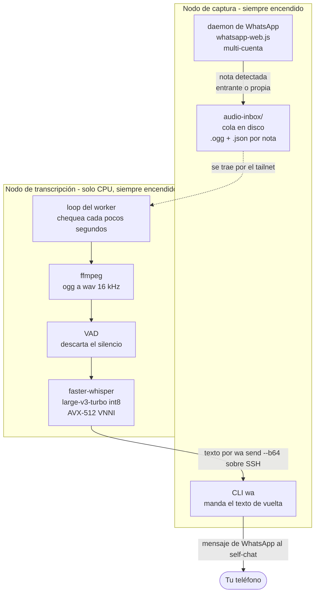

# WhatsApp Voice Transcriber

> **Audio de WhatsApp → transcripción local → texto de vuelta al self-chat. Sin STT en la nube.**

Pipeline de dos componentes que transcribe automáticamente cada nota de voz que recibís por WhatsApp — y cada memo que te mandás a vos mismo — con un motor de reconocimiento local. El texto vuelve como un mensaje de WhatsApp común. El audio nunca sale de la red.

Empezó como herramienta propia sobre una GPU de casa. Hoy es un **motor de transcripción compartido** que varios técnicos usan a diario, y del que cuelgan otros servicios.

---

## Lo interesante: el costo era fijo, no proporcional

La versión original corría `whisper.cpp` en GPU y andaba bien. Después los números dejaron de cerrar — medidos con el modelo **ya residente en RAM**, así que no es tiempo de carga:

| Nota de voz | Tiempo de pared |
|---|---|
| 2 s | 33 s |
| 3 s | 33 s |
| 6 s | 36 s |
| 37 s | 74 s |

**Una nota de 3 segundos costaba lo mismo que una de 30.** `whisper.cpp` rellena cada clip hasta una **ventana fija de 30 segundos**, así que una nota corta corre el encoder completo sobre puro silencio. Casi todas las notas son cortas: casi todas pagaban por silencio.

Eso reencuadra el problema. El cuello nunca fue el hardware, y una GPU más rápida no habría comprado nada. Dos cambios lo resolvieron:

1. **Detección de voz (VAD)** — el silencio se descarta antes de que el modelo lo vea.
2. **Kernels int8 de CTranslate2** — que usan las instrucciones **AVX-512 VNNI** que la CPU ya tenía. `whisper.cpp` no aprovecha ese camino; CTranslate2 está compilado para él.

Mismo audio, misma máquina, N=3 por lado, descartando el warm-up:

| Audio | Antes | Después | A nivel motor |
|---|---|---|---|
| 10,5 s | 34,3 s | 4,8 s | **7,1x** |
| 37 s | 74 s | 10,8 s | **6,9x** |
| 6 min | 585 s | 96,7 s | **6,0x** |

**End-to-end la mejora es 3,2x** — de 34 s a unos 10 s de pared por nota — porque el diseño desplegado recarga el modelo por audio en vez de sostener un daemon residente. Están los dos números porque no son el mismo número: 6-7x es motor contra motor; 3,2x es lo que realmente esperás.

**La GPU se fue del diseño entero.** Misma clase de rendimiento, sin acelerador que agendar, despertar ni reservar.

### Dónde se rompió el modelo del costo

Modelar el costo como `ventanas x constante` predijo bien la nota de 37 segundos —2 ventanas, ~68 s previstos contra 74 s medidos— y **falló en la de 6 minutos**: ~465 s previstos, 585 s medidos, dos veces, idénticos. El término que faltaba es el **decoder**, que escala con los tokens producidos: el habla continua y densa lo carga en cada ventana, mientras que una nota corta apenas lo toca. El modelo de ventanas acierta en dirección y subestima en audio largo y denso.

Queda escrito porque una predicción que no puede fallar no prueba nada.

### Calidad

Validada contra una grabación con terminología plantada a propósito (siglas, IPs, nombres propios, números), y no contra la salida de otro modelo: un modelo más fuerte sigue siendo otra opinión, y los dos pueden equivocarse en el mismo lugar. Sobre 12 términos decidibles el motor turbo int8 sacó **11/12, empatando al modelo de precisión completa que reemplazó**, y difiere solo en una palabra rara. Una sigla la fallaron **todos** los motores probados, así que es un límite del reconocedor y no de este cambio.

No está validado en audio largo, ruidoso y con varios hablantes. Es un límite real, dicho y no maquillado.

---

## Arquitectura

Dos componentes sobre una red privada (Tailscale). La forma nunca cambió: cambió el motor de la segunda caja.



### Por qué dos nodos

| | Nodo de captura | Nodo de transcripción |
|---|---|---|
| **Rol** | Sostiene la sesión de WhatsApp, captura el audio y manda el texto de vuelta | Vacía la cola y transcribe |
| **Por qué separados** | WhatsApp necesita una sesión persistente para recibir mensajes: vive donde corre ese daemon y sobrevive a los reinicios | El motor es compartido — otros servicios usan la misma capacidad en vez de duplicarla por consumidor |
| **Modo de falla** | Si el transcriptor está caído, el audio se encola y se procesa después | Si el nodo de captura está caído no hay capturas nuevas; la sesión sobrevive a reinicios |

El diseño original **necesitaba** la cola como buffer, porque la máquina con GPU dormía y despertaba con un timer cada 4 minutos. Ese motivo ya no existe: los dos nodos están siempre encendidos y el worker chequea cada pocos segundos, así que una nota de 10 segundos vuelve en unos 10 segundos. La cola quedó porque sigue desacoplando las dos mitades.

---

## Manejo de fallas

El motor es la parte con más chances de fallar, así que es la parte con menos autoridad:

- **Motor no disponible** → cae al binario `whisper-cli` original. Más lento (~34 s), pero no se pierde nada.
- **Falla dura** — salida distinta de cero de ffmpeg o del modelo → el archivo original se **conserva**, se persiste un contador de intentos y tras N reintentos pasa a `failed/`. Una falla nunca se reporta como "silencio".
- **Entrega sin confirmar** → el archivo no se borra. Se elimina recién cuando el mensaje salió, así nada se pierde ni se procesa dos veces.

Una transcripción vacía es una respuesta válida —la nota era realmente silencio— y se distingue de un error por el código de salida, no por lo vacío de la salida.

---

## Cuando la dependencia se rompe abajo: `"r"`

Las notas de voz dejaron de descargarse. El texto seguía funcionando. El único rastro en el log era este:

```
[ERROR] [LISTENER] listener audio: r
```

`whatsapp-web.js` hace ingeniería inversa de WhatsApp Web, así que se rompe cuando WhatsApp cambia algo. Ese es el costo del enfoque, y lo interesante no es que se haya roto: es que **estuvo roto un día entero con todos los monitores en verde**, y que el error era ilegible.

### Por qué el error no decía nada

`e.message` valía `"r"`. Al pedirle el stack, `e.stack` valía `"r: r"` — cero frames.

La excepción se lanza **dentro del contexto de página**. Puppeteer la serializa para cruzar la frontera y sobreviven solo `name` y `message`; en el bundle minificado de WhatsApp los dos son la letra `r`. No había nada que extraerle al objeto de error.

**La salida fue dejar de interrogar el error e instrumentar el camino donde ocurre** — tres sondas inyectadas en la página, cada una con una pregunta:

| Sonda | Pregunta | Respuesta | Qué descartó |
|---|---|---|---|
| 1 | ¿Qué propiedades propias trae el error? | `DataError` de IndexedDB | La descarga y el descifrado |
| 2 | ¿Qué paso lanza la excepción? | La búsqueda del mensaje | El download manager |
| 3 | ¿Cómo es el id realmente? | `$1`, no `_serialized` | — |

> **La pista decisiva fue una ausencia.** La sonda 2 armaba su resultado como `{ msgId: msgId, ... }` y el JSON impreso **no tenía el campo `msgId`**. `JSON.stringify` descarta las claves cuyo valor es `undefined`. Ese hueco *era* el bug: `undefined` estaba llegando a IndexedDB, que respondía, con toda precisión, que no se había especificado ninguna clave.

### Causa raíz

WhatsApp dejó de exponer `_serialized` en las claves de mensaje. El campo equivalente ahora es `$1`:

```
keys: ["fromMe", "remote", "id", "$1"]
$1:   "false_<id-de-contacto>@lid_<HEX>"
```

La librería sigue leyendo `this.id._serialized` dentro de `downloadMedia()`, obtiene `undefined` y se lo pasa a `Msg.getMessagesById([undefined])`. **No había a qué actualizar**: la versión instalada ya era la última publicada. El texto no se vio afectado porque su camino nunca serializa un id de mensaje.

### La hipótesis que estaba equivocada

Al ver `@lid` dentro del id, la primera hipótesis fue la migración de WhatsApp a direcciones LID — plausible y consistente con la cronología. **Era incorrecta.** Los envíos *a* direcciones `@lid` funcionaban antes, durante y después del corte. El LID aparece dentro del id pero es circunstancial; lo que cambió fue *el nombre del campo*, no el esquema de direccionamiento.

Queda registrado porque la hipótesis equivocada era la atractiva: el `@lid` ya había dado problemas en este código, y eso lo hacía sospechoso **por disponibilidad, no por evidencia**.

### Dos decisiones en el arreglo

**No parchear `node_modules`.** Una línea sobre la librería habría funcionado. Se descartó porque `npm install` la borra en silencio, y la falla resultante se vería exactamente como esta —audio muerto, sin error utilizable— salvo que la causa ya no estaría a la vista.

**No depender de `$1`.** Es un símbolo generado por el minificador y puede ser `$2` en el próximo build. `serialiseMsgKey()` degrada en tres escalones —`_serialized` → `$1` → **reconstrucción desde los campos estables `fromMe`/`remote`/`id`**— y la reconstrucción produce el string idéntico.

### El canario, y la primera versión que se tiró a la basura

Ahora corre un chequeo cada pocos días contra el camino de media.

**La primera versión pasaba en las dos cuentas y se borró antes de desplegarla.** Agarraba el modelo del mensaje directo de la colección y bajaba la media **sin serializar nunca un id** — o sea que habría reportado verde durante toda la caída. Probaba algo *contiguo* a la falla.

La versión desplegada recorre el camino de producción: serializar el id → **buscar el mensaje por ese id** → recién ahí descargar. El paso 2 es el que estallaba.

Dos reglas en su contrato de resultado:

- **"Sin material" no es verde.** Si no hay nota de voz contra la cual probar, reporta que *no pudo correr*. Un canario mudo es indistinguible de uno sano — que es, otra vez, el bug original.
- **Reporta por qué puerta entró** (`via`). Verde vía `rebuilt` significa que el campo se renombró de nuevo y el fallback está sosteniendo el sistema — conviene saberlo antes de que falle del todo.

Está probado en **los dos** sentidos. Un canario que nunca se vio en rojo no es un canario probado.

### Un bug más, encontrado al salir

La misma causa raíz había roto en silencio la confirmación de entrega. La espera del acknowledgement comparaba `enviado.id._serialized === evento.id._serialized` — con **ambos lados `undefined`**. Como `undefined === undefined` es `true`, la espera se resolvía con el acknowledgement de *cualquier* mensaje. No venía confirmando la entrega de nada.

El arreglo además se niega a adivinar: si no puede serializar el id, no engancha listener y la espera cae a su timeout, porque un comparador que matchea todo es peor que no tener confirmación.

---

## El caso del self-forward

Te mandás una nota de voz **a vos mismo** —una idea al vuelo— y recibís la transcripción en tu self-chat. Sirve para memos manejando, capturar ideas sin tipear, o darle contenido hablado largo a un modelo que no acepta audio.

### Nota de ingeniería: la trampa del `@lid`

Detectar un self-forward comparando `message.from === message.to` **no funciona** en WhatsApp Web. WhatsApp serializa `from` como `<numero>@c.us` y `to` como `<id-de-cuenta>@lid` —un formato de identificador más nuevo— así que los dos strings nunca coinciden, ni para la misma persona. Hay que llamar a `getContactById(message.to)` y chequear `.isMe` en el Contact que devuelve.

```js
// Mal - nunca van a coincidir
if (msg.from === msg.to) { /* no dispara nunca */ }

// Bien
const dest = await client.getContactById(msg.to);
if (dest && dest.isMe) { enqueue(msg, "self"); }
```

---

## Qué hay en este repositorio

| Ruta | Qué es |
|---|---|
| `daemon/audio-capture.js` | Daemon de WhatsApp: sesión, captura multi-cuenta, detección de self-forward, escritura en la cola, serialización de id tolerante al minificador y descarga de media propia |
| `daemon/media-selftest.js` | Canario activo del camino de media — serializa un id, busca el mensaje **por ese id** y recién ahí descarga. El paso que se rompió |
| `transcriber/transcribe-fw.py` | **Motor actual.** faster-whisper int8 en CPU con VAD. Imprime la transcripción en stdout y nada más |
| `transcriber/transcribir-entrantes.ps1` | **Implementación original en GPU** — whisper.cpp + CUDA en Windows. Se conserva a propósito: es donde nació el proyecto y es la línea base contra la que se comparan las mediciones de arriba |
| `transcriber/setup-task.ps1` | Instalador de la tarea programada de la versión Windows original |

La orquestación alrededor del motor —contadores de reintento, locks, confirmación de entrega— es específica del despliegue y no se publica acá. Lo que sí se publica es la parte portable: la llamada al motor y el daemon de captura.

---

## Requisitos

**Nodo de captura** — Node.js 20+, [whatsapp-web.js](https://github.com/pedroslopez/whatsapp-web.js) 1.34+, Chrome headless, un CLI `wa` que envuelve la API HTTP local del daemon.

**Nodo de transcripción** — Python 3, `faster-whisper`, `ffmpeg`. Una CPU con AVX-512 VNNI da la aceleración int8 descrita arriba; sin ella el motor igual corre, solo que más lento.

```bash
python3 -m venv venv
venv/bin/pip install faster-whisper
venv/bin/python transcriber/transcribe-fw.py nota.ogg
```

La primera corrida baja el modelo a la caché local; después funciona offline.

---

## Modelo de privacidad

Lo único que sale de la red es el mensaje de texto final por WhatsApp — lo mismo que si lo hubieras tipeado vos.

---

📖 [Full documentation in English](README.md)
