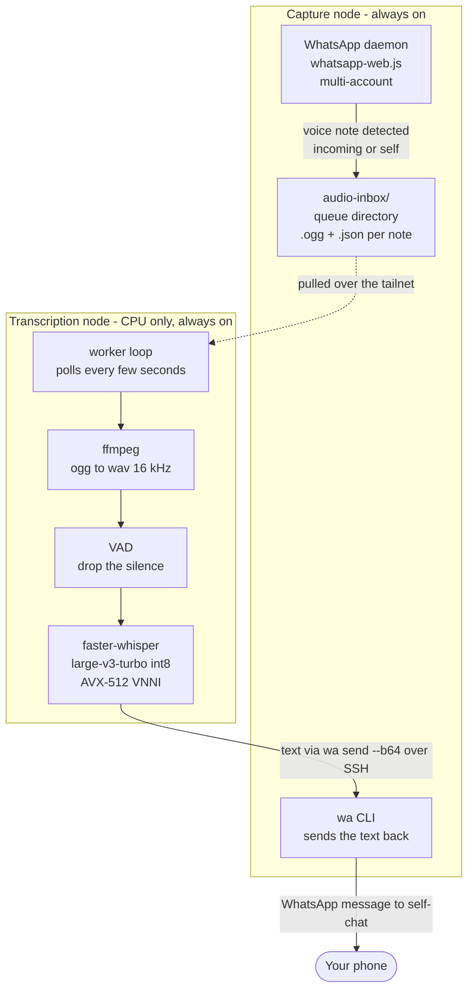
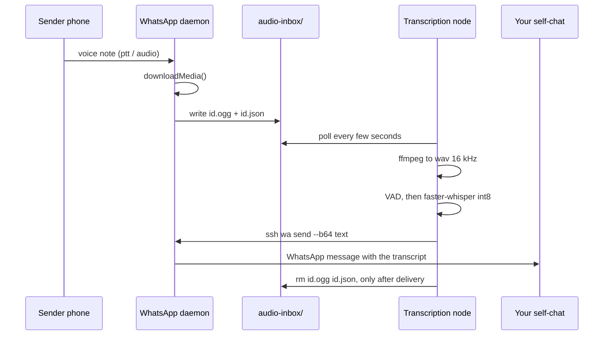

# WhatsApp Voice Transcriber

> **Incoming WhatsApp voice note → local transcription → text sent back to you. Zero cloud STT.**

A two-component pipeline that transcribes every WhatsApp voice note you receive — and every voice memo you send to yourself — with a local speech-to-text engine. The text is delivered back as a regular WhatsApp message. Audio never leaves the network.

[](LICENSE)
[]()
[]()
[]()

It started as a personal tool on a home GPU. It now runs as a **shared transcription engine** several engineers use daily, with other services calling the same capability.

---

## The interesting part: the cost was fixed, not proportional

The original version ran `whisper.cpp` on a 24 GB GPU and worked fine. Then the numbers stopped making sense — measured with the model **already resident in RAM**, so this is not load time:

| Voice note | Wall clock |
|---|---|
| 2 s | 33 s |
| 3 s | 33 s |
| 6 s | 36 s |
| 37 s | 74 s |

**A 3-second note cost the same as a 30-second one.** `whisper.cpp` pads every clip to a **fixed 30-second window**, so a short note runs the full encoder over mostly silence. Almost every voice note is short — so almost every note was paying for silence.

That reframes the problem: the bottleneck was never the hardware, and a faster GPU would have bought nothing. Two changes fixed it.

1. **Voice-activity detection** — silence is dropped before the model sees it.
2. **CTranslate2 int8 kernels** — which use the **AVX-512 VNNI** instructions already present in the CPU. `whisper.cpp` does not exploit that path; CTranslate2 is built for it.

Same audio, same machine, N=3 per side, warm-up discarded:

| Audio | Before | After | Engine-level |
|---|---|---|---|
| 10.5 s | 34.3 s | 4.8 s | **7.1x** |
| 37 s | 74 s | 10.8 s | **6.9x** |
| 6 min | 585 s | 96.7 s | **6.0x** |

**End to end the win is 3.2x** — 34 s to about 10 s of wall clock per note — because the deployed design reloads the model per audio instead of keeping a resident daemon. Both numbers are quoted because they are not the same number: 6-7x is engine against engine; 3.2x is what you actually wait for.

**The GPU left the design entirely.** Same throughput class, no accelerator to schedule, wake or reserve.

### Where the model of the cost broke

Modelling cost as `windows x constant` predicted the 37-second note well — 2 windows, ~68 s predicted against 74 s measured — and **failed on the 6-minute note**: ~465 s predicted, 585 s measured, twice, identically. The missing term is the **decoder**, which scales with tokens produced: dense continuous speech loads it on every window while a short note barely touches it. The window model is right in direction and understates on long, dense audio.

It is written down because a prediction that cannot fail proves nothing.

### Quality

Validated against a planted-terminology recording (acronyms, IP addresses, proper nouns, numbers) rather than against another model's output — a stronger model is still just another opinion, and the two can be wrong in the same place. On 12 decidable terms the int8 turbo engine scored **11/12, matching the full-precision model it replaced**, differing only on one rare word. One acronym was missed by *every* engine tested, which makes it a limit of the recognizer, not of this change.

Not validated on long, noisy, multi-speaker audio. That is a real limit, stated rather than glossed.

---

## Architecture

Two components on a private network (Tailscale). The shape never changed — only the engine in the second one did.



### Why two nodes

| | Capture node | Transcription node |
|---|---|---|
| **Role** | Owns the WhatsApp session, captures audio, sends the text back | Drains the queue and transcribes |
| **Why separate** | WhatsApp needs a persistent session to receive messages, so it lives wherever that daemon runs and survives reboots | The engine is shared — other services call the same capability instead of duplicating it per consumer |
| **Failure mode** | If the transcriber is down, audio queues and drains later | If the capture node is down, no new captures; the session survives reboots |

The original design **needed** the queue as a buffer, because the GPU machine slept and woke on a timer every 4 minutes. That reason is gone: both nodes are always on and the worker polls every few seconds, so a 10-second note comes back in about 10 seconds. The queue stayed because it still decouples the two halves.

---

## Failure handling

The engine is the part most likely to fail, so it is the part with the least authority:

- **Engine unavailable** → falls back to the original `whisper-cli` binary. Slower (~34 s), nothing lost.
- **Hard failure** — non-zero exit from ffmpeg or the model → the source file is **kept**, a retry counter is persisted, and after N attempts it moves to `failed/`. A failure is never reported as "silence".
- **Delivery not confirmed** → the source file is not deleted. Files are removed only after the message is confirmed sent, so nothing is lost or processed twice.

An empty transcript is a valid answer — the note really was silence — and is distinguished from an error by the exit code, not by the emptiness of the output.

---

## Sequence: incoming voice note



---

## The self-forward use case

Send a voice note **to yourself** — a thought on the go — and get the transcription in your self-chat. Useful for memos while driving, capturing ideas without typing, or feeding long spoken content to a model that does not accept audio.

### Engineering note: the `@lid` trap

Detecting a self-forwarded message by comparing `message.from === message.to` does **not work** in WhatsApp Web. WhatsApp serialises `from` as `<number>@c.us` and `to` as `<account-linked-id>@lid` — a newer identifier format — so the two strings never match, even for the same person. Call `getContactById(message.to)` and check `.isMe` on the returned Contact.

```js
// Wrong - these will never match
if (msg.from === msg.to) { /* never fires */ }

// Right
const dest = await client.getContactById(msg.to);
if (dest && dest.isMe) { enqueue(msg, "self"); }
```

### Why base64 over SSH

Passing UTF-8 text with accents, newlines or special characters through SSH shell arguments is fragile — shells interpret many characters as metacharacters. Encoding the message as base64 before the SSH call and decoding it on the other side makes the transport safe regardless of content.

---

## Output format

Each transcription arrives as a WhatsApp message to your self-chat:

```
Audio entrante [personal] 14:32
De: María García (+5491155551234) en Grupo Familia
Che, no te olvides de traer el documento para la reunión del jueves...
```

---

## What is in this repository

| Path | What it is |
|---|---|
| `daemon/audio-capture.js` | WhatsApp daemon: session, multi-account capture, self-forward detection, queue writing |
| `transcriber/transcribe-fw.py` | **Current engine.** faster-whisper int8 on CPU with VAD. Prints the transcript to stdout and nothing else |
| `transcriber/transcribir-entrantes.ps1` | **Original GPU implementation** — whisper.cpp + CUDA on Windows. Kept deliberately: it is where the project started and it is the baseline the measurements above are compared against |
| `transcriber/setup-task.ps1` | Scheduled-task installer for the original Windows version |

The orchestration around the engine — retry counters, locks, delivery confirmation — is deployment-specific and not published here. What is published is the portable part: the engine call and the capture daemon.

---

## Requirements

**Capture node** — Node.js 20+, [whatsapp-web.js](https://github.com/pedroslopez/whatsapp-web.js) 1.34+, headless Chrome, a `wa` CLI wrapper over the daemon's local HTTP API.

**Transcription node** — Python 3, `faster-whisper`, `ffmpeg`. A CPU with AVX-512 VNNI gives the int8 speed-up described above; without it the engine still runs, just slower.

```bash
python3 -m venv venv
venv/bin/pip install faster-whisper
venv/bin/python transcriber/transcribe-fw.py note.ogg
```

The first run downloads the model to the local cache; after that it runs offline.

### Setup — capture side

```js
const { attachAudioCapture } = require("./audio-capture");

// after client is ready:
attachAudioCapture(client, {
  label:    "personal",
  inboxDir: path.join(__dirname, "audio-inbox"),
  log:      console.log,
});
```

---

## Privacy model

| Data | Where it goes |
|---|---|
| Audio content | Never leaves the private network |
| Transcription text | Sent back to the capture node over SSH, then delivered as a normal WhatsApp message |
| Sender metadata | Stays local; only included in the text you receive |
| WhatsApp session | Lives on the capture node; WhatsApp servers see a normal multi-device session |

The only data that leaves the network is the final text message through WhatsApp — the same as if you had typed it yourself.

---

## License

MIT — see [LICENSE](LICENSE).

📖 [Documentación en español](README.es.md)
