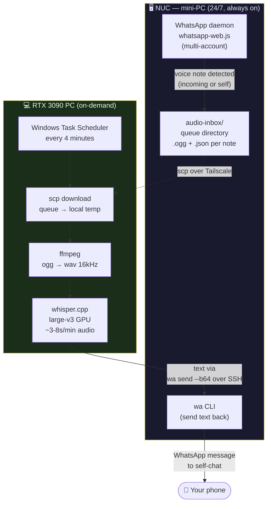
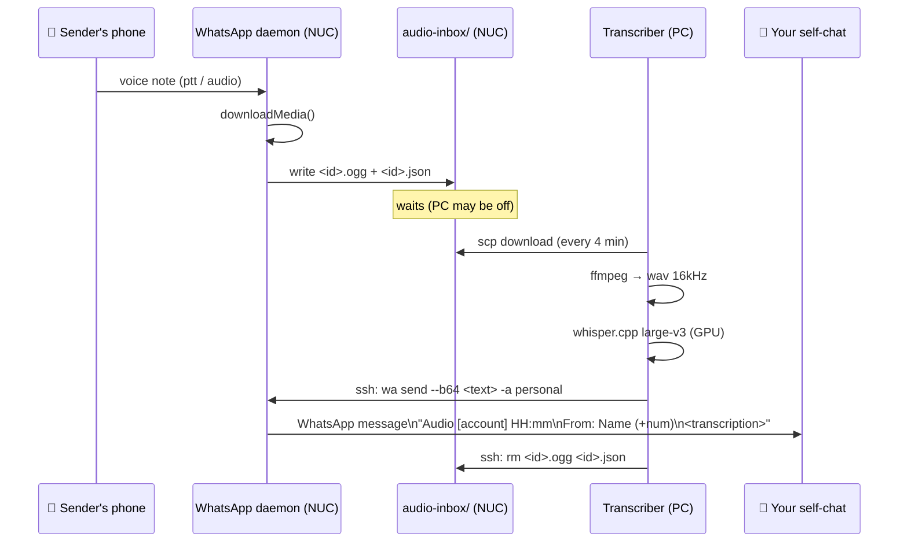
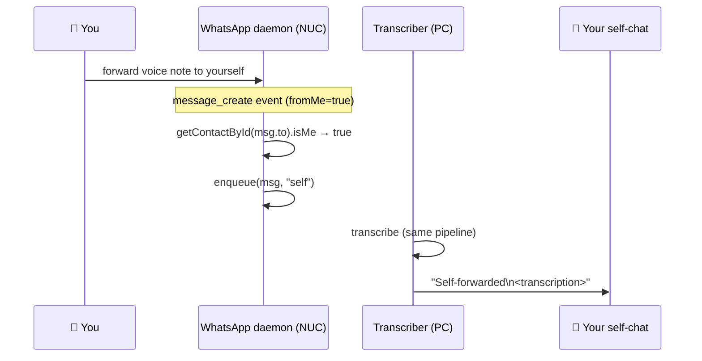

# WhatsApp Voice Transcriber

> **Incoming WhatsApp voice note → local GPU transcription → text sent back to you. Zero cloud STT. 100% private.**

A two-component pipeline that automatically transcribes every WhatsApp voice note you receive — and every voice memo you send to yourself — using a local [whisper.cpp](https://github.com/ggerganov/whisper.cpp) instance on your own GPU. The transcribed text is delivered back to you as a regular WhatsApp message.

[](LICENSE)
[]()
[]()
[]()

---

## Why I built this

Voice notes are the dominant communication format in WhatsApp (especially in Latin America). The problems with the standard experience:

- **Voice notes are annoying to listen to** in meetings, quiet spaces, or when you're in a hurry.
- **Cloud STT services** (Google, Azure, AWS) receive your audio — including conversations you may want to keep private.
- **WhatsApp's built-in transcription** is mediocre and only available in some regions.
- **Self-forwarded voice memos** (thinking out loud → send to yourself) have no transcription at all.

This system solves all of it with a pipeline that runs on hardware you already own, never sends audio to external servers, and operates 24/7 even when your PC is asleep.

---

## Architecture

The system has two physical components connected over a private network (Tailscale):



### Why two nodes?

| Component | Always-on NUC | On-demand PC |
|---|---|---|
| **Role** | Owns the WhatsApp session, captures audio, routes messages | Runs GPU transcription, drains the queue |
| **Why here** | WhatsApp requires a persistent session to receive messages | RTX 3090 is too power-hungry to run 24/7 just for transcription |
| **Failure mode** | If PC is off, audio queues up and processes when PC wakes | If NUC is down, no new captures — but session survives reboots |

**The queue acts as a buffer**: audio is never lost because the PC is asleep. When the PC wakes, the Task Scheduler fires within 4 minutes and drains everything accumulated.

---

## Sequence: incoming voice note



---

## The self-forward use case

You can send a voice note **to yourself** — recording a thought on the go — and receive the transcription in your self-chat automatically. This is particularly useful for:

- Voice memos while driving
- Rapid idea capture without typing
- Feeding long-form spoken content to an LLM that doesn't accept audio



### Engineering note: the `@lid` trap

Detecting a self-forwarded message by comparing `message.from === message.to` does **not work** in WhatsApp Web. WhatsApp serialises `from` as `<number>@c.us` and `to` as `<account-linked-id>@lid` — a newer identifier format — so the two strings will never be equal even for the same person. The correct approach is to call `getContactById(message.to)` and check the `.isMe` property on the returned Contact object.

```js
// Wrong — these will never match
if (msg.from === msg.to) { ... }

// Correct
const dest = await client.getContactById(msg.to);
if (dest && dest.isMe) { enqueue(msg, "self"); }
```

---

## Features

| Feature | Detail |
|---|---|
| **100% local STT** | whisper.cpp large-v3 on your GPU — no audio leaves your machine |
| **Multi-account** | Captures from all your WhatsApp accounts simultaneously |
| **Self-forward support** | Voice memos you send to yourself are also transcribed |
| **Async queue** | PC can be off; audio accumulates and processes when it wakes |
| **Labelled output** | Transcription includes: account, time, sender name, group name |
| **Base64 transport** | Text sent over SSH as base64 — accents/newlines survive correctly |
| **Clean dequeue** | Files deleted from NUC only after successful delivery to self-chat |

---

## Output format

Each transcription arrives as a WhatsApp message to your self-chat:

```
Audio entrante [personal] 14:32
De: María García (+5491155551234) en Grupo Familia
Che, no te olvides de traer el documento para la reunión del jueves...
```

For self-forwarded notes:
```
Audio entrante [personal] 09:15
De: Self-forwarded
Tengo que acordarme de revisar el presupuesto de la obra antes de hablar con el contratista...
```

---

## Requirements

**NUC / mini-PC (always-on, Linux)**
- Node.js 20+
- [whatsapp-web.js](https://github.com/pedroslopez/whatsapp-web.js) 1.34+
- Google Chrome (headless)
- `wa` CLI (wrapper script over the daemon's HTTP API via localhost Bearer token)

**PC (GPU, Windows)**
- NVIDIA GPU with CUDA 12
- [whisper.cpp](https://github.com/ggerganov/whisper.cpp) compiled with CUDA
- Model `ggml-large-v3.bin` (~3 GB, download from [HuggingFace](https://huggingface.co/ggerganov/whisper.cpp))
- ffmpeg (`winget install Gyan.FFmpeg`)
- SSH key access to NUC (for SCP and `wa` CLI)

---

## Setup

### 1. NUC — integrate audio capture into your daemon

```js
const { attachAudioCapture } = require("./audio-capture");

// after client is ready:
attachAudioCapture(client, {
  label:    "personal",
  inboxDir: path.join(__dirname, "audio-inbox"),
  log:      console.log,
});
```

### 2. PC — deploy the transcription script

```powershell
# Clone and install
git clone https://github.com/msemino/whatsapp-voice-transcriber
cd whatsapp-voice-transcriber

# Edit transcriber/transcribir-entrantes.ps1 — set NucHost, NucUser, SelfNumber

# Register the Task Scheduler job (run as Administrator)
powershell -ExecutionPolicy Bypass -File transcriber\setup-task.ps1
```

### 3. Verify

1. Send yourself a voice note on WhatsApp.
2. Wait up to 4 minutes.
3. Check your self-chat — the transcription should appear.

Or trigger immediately:

```powershell
powershell -ExecutionPolicy Bypass -File transcriber\transcribir-entrantes.ps1
```

---

## Engineering notes

### Why Task Scheduler instead of a Windows service?
The transcription script uses CDP to send text via the NUC's WhatsApp daemon. It's a stateless batch job — run, drain, exit. A Task Scheduler job with "If task is already running, do not start a new instance" is simpler, more observable (event log), and avoids the complexity of a long-running service for something that takes <30 seconds per run.

### Why not transcribe on the NUC?
The NUC has no GPU. whisper.cpp large-v3 on CPU takes ~15 minutes for a 1-minute voice note. The RTX 3090 does it in 3-8 seconds. Keeping transcription on the PC keeps the NUC lean and the latency acceptable.

### Why base64 over SSH?
Passing UTF-8 text with accents, newlines, or special characters through SSH shell arguments is fragile — shells interpret many characters as metacharacters. Encoding the message as base64 before the SSH call and decoding it on the NUC side makes the transport fully safe regardless of content.

```powershell
# Send side (PC)
$b64 = [Convert]::ToBase64String([System.Text.Encoding]::UTF8.GetBytes($fullMsg))
ssh nuc "wa send $SelfNumber --b64 $b64 -a personal"

# Receive side (NUC wa CLI) — decodes before calling the daemon API
```

---

## Privacy model

| Data | Where it goes |
|---|---|
| Audio content | Never leaves your LAN/VPN — downloaded from NUC to PC via SCP |
| Transcription text | Sent from PC → NUC via SSH, then NUC → WhatsApp as a regular message |
| Sender metadata | Stays local (name, number in the queue JSON); only included in the text you receive |
| WhatsApp session | Lives on the NUC; WhatsApp servers see a normal multi-device session |

The only data that leaves your network is the final text message through WhatsApp — the same as if you had typed it yourself.

---

## Related projects

- **[local-voice-recorder](https://github.com/msemino/local-voice-recorder)** — same whisper.cpp stack; press a button to record, get text in your clipboard.
- **[self-hosted-ai-lab](https://github.com/msemino/self-hosted-ai-lab)** — the 2-node system this pipeline is part of.
- **[local-agent-orchestrator](https://github.com/msemino/local-agent-orchestrator)** — AI orchestrator on the NUC that processes transcribed content.

---

## License

MIT © Marcelo Semino
